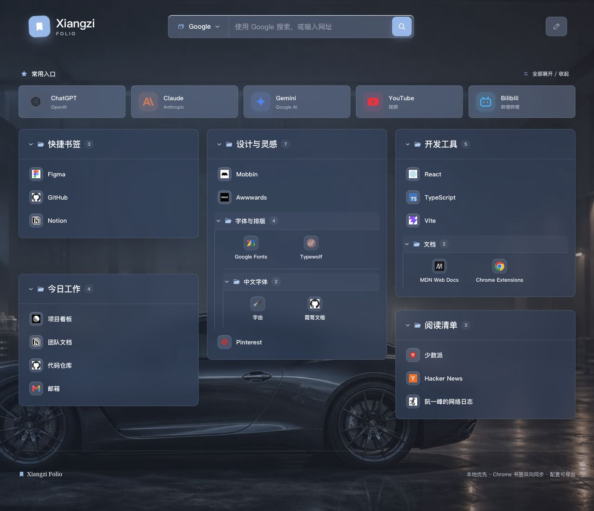
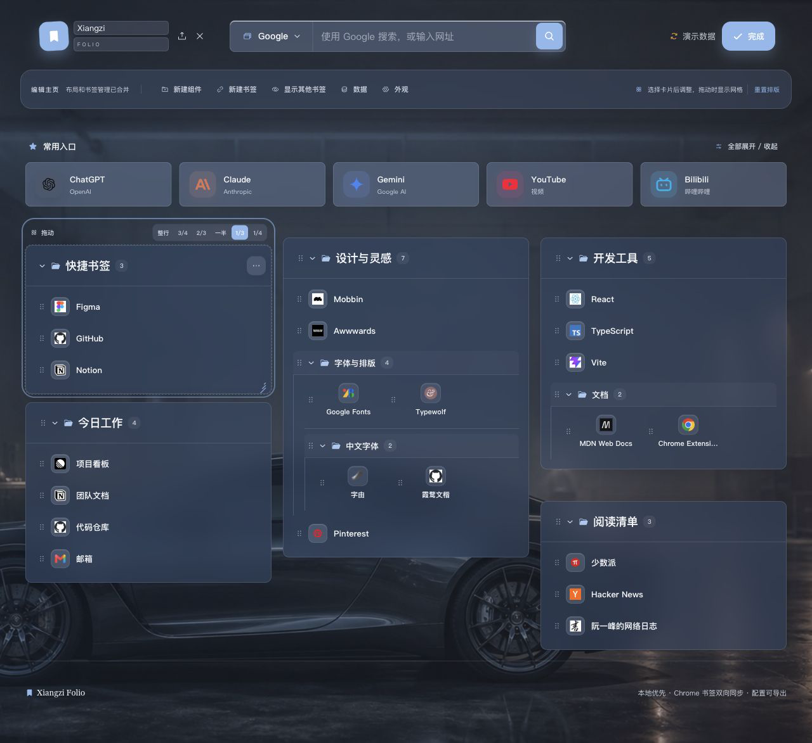
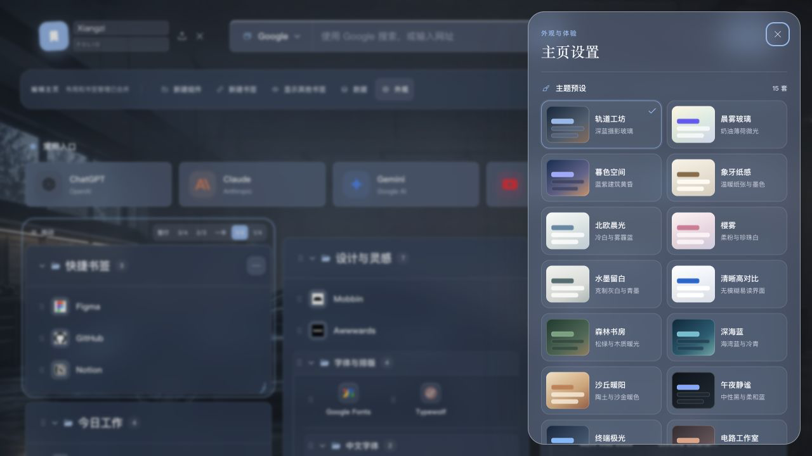
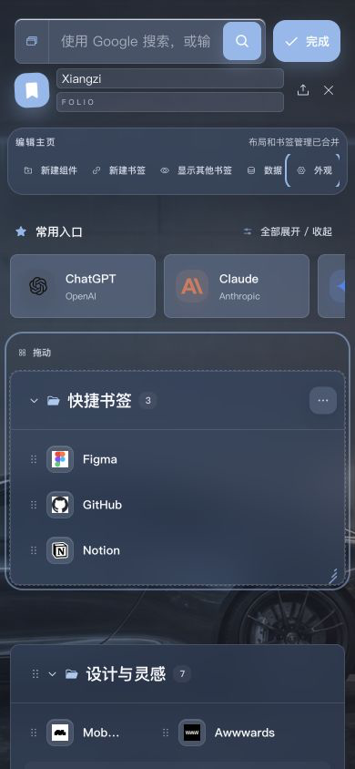

# Xiangzi Folio 工程与体验审查

审查日期：2026-07-15  
范围：默认主页、编辑模式、外观设置、书签编辑、移动端首屏、配置导入、Chrome 书签写入、构建与依赖。

## 结论

工程没有高危依赖问题，核心书签读写与三字符样式元数据已有较完整测试。本轮直接修复了会影响真实使用的默认值不一致、误删 API、导入数据不可信、弹窗可访问性、键盘菜单、编辑标题截断、移动端编辑入口溢出、扩展图标缺失等问题。优化后默认主页无横向溢出，轨道工坊保持默认主题与 10% 遮罩。

## 逐步审查与处理

1. 默认主页：通过。默认主题、背景遮罩、五个常用入口、三级视觉层次和 12 栏布局均正常；新建一级组件现统一为 4 栏目录样式。

   

2. 编辑模式：通过。隐藏操作区不再占据标题宽度，原先被截断的“设计与灵感”“开发工具”等标题恢复完整；书签增加直接删除入口，文件夹操作仍按渐进方式展示。

   

3. 外观设置：通过。15 套主题预览完整，轨道工坊默认值显示为 20px 模糊、10% 遮罩；帮助文字字号提升。打开弹窗时锁定背景滚动、屏蔽背景交互并限制焦点，关闭后焦点回到“外观”。

   

4. 键盘与菜单：通过。搜索引擎选择器支持方向键、Home、End 与 Escape，点击或聚焦到外部会关闭；文件夹样式菜单支持 Escape、外部点击和单选语义。

5. 默认创建逻辑：通过。一级文件夹默认目录样式/4 栏，嵌套文件夹默认图标样式/4 栏；图标与混合文件夹中新建书签默认 1.5 栏图标，其他容器按自身语义创建。

6. 数据安全：通过。JSON 备份在修改 Chrome 书签前完成结构、重复 ID、深度、数量及配置字段校验；主题、宽度、遮罩、模糊、颜色和本地图片字段均会清洗。书签删除使用非递归 API，文件夹才使用递归删除。

7. 移动端：通过。390×844 首屏无横向页面溢出，品牌名称/副标题可编辑，五个编辑入口保持单行可见且不再把“数据”拆成竖排文字。

   

8. 扩展交付：通过。Manifest 增加 16/32/48/128px 图标及工具栏图标，版本升级到 1.1.1；生产包包含新标签页、后台脚本、主题图片、图标和静态资源。

## 工程校验

- `npm test -- --run`：5 个测试文件、37 个测试全部通过。
- `npm run build`：TypeScript 与 Vite 生产构建通过；主脚本 370.84kB，gzip 109.77kB；CSS 51.51kB，gzip 10.75kB。
- `npm audit --omit=dev`：0 个已知漏洞（本轮初始扫描）。
- `git diff --check`：通过。
- 扩展 ZIP：完整性检测通过，17 个条目，SHA-256 `29b35a6c4fe282426100d5f6a396eae65940b8e2c6fbe1706d8e7d701b2ddecc`。

## 仍可做但本轮不建议强行改动

- `App.tsx` 和 `FolderView.tsx` 仍偏大，可在后续新增功能前按搜索、编辑、导入导出和拖放职责拆分；当前已有覆盖面较高的回归测试，立即重构的收益低于回归风险。
- Vite、TypeScript、Vitest 等存在下一代主版本，但本轮不做跨主版本升级，避免把产品优化和工具链迁移混在一起。
- 本地演示数据无法完全代表用户真实 Chrome 书签规模；发布前仍应在真实 Chrome 中用超长标题、空文件夹、深层目录和大量书签做一次人工验收。本轮已通过适配器单测和浏览器演示页验证，但不宣称覆盖所有 Chrome 版本差异或完整 WCAG 合规。
