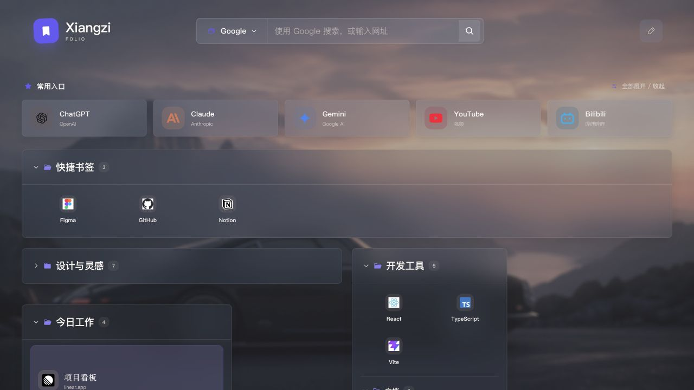
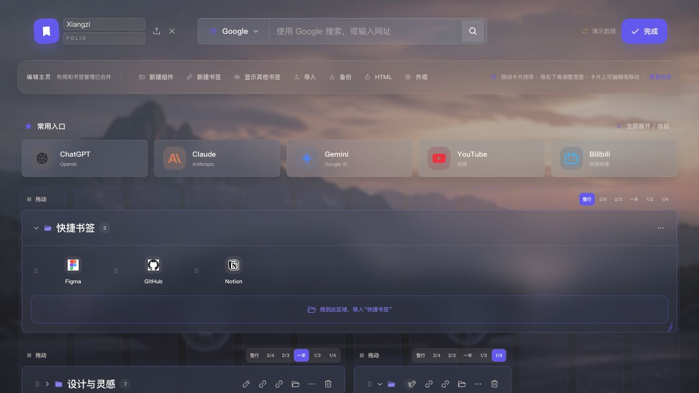
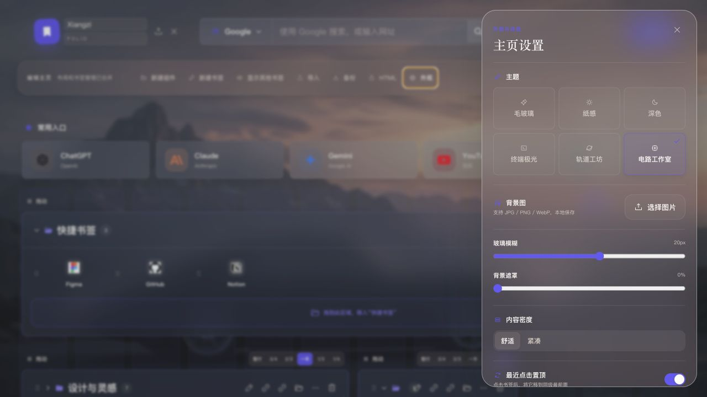
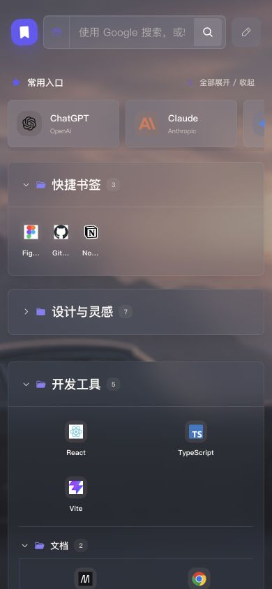

# Xiangzi Folio 全局产品与工程审查

审查日期：2026-07-14

## 审查范围

- 普通首页
- 统一编辑模式
- 外观设置
- 390 × 844 移动端
- Chrome MV3 权限、书签和本地配置架构
- 测试、构建、性能与可维护性

## 流程截图

### 1. 普通首页 — 基础体验良好，信息层级仍可加强

优点：搜索、常用入口和文件夹结构清楚；摄影玻璃风格已经统一。风险：暗色壁纸上的小字和弱边框对比度偏低，首屏缺少一个明确视觉主轴。

### 2. 编辑模式 — 功能完整，但操作密度过高

优点：布局和书签管理已合并，所有常用动作都有可见入口。风险：每个组件重复出现六个宽度按钮、拖动区和多枚图标，页面进入编辑态后噪声陡增。

### 3. 外观设置 — 信息架构清楚，面板仍需键盘与反馈完善

优点：主题、背景、模糊、密度、强调色分组自然。风险：缺少明确保存状态、键盘焦点管理和 Escape 关闭；三款 geek 主题目前共用同一张背景图，仅靠色调区分。

### 4. 移动端 — 能重排，但图标与横向内容可读性下降

优点：核心结构没有溢出，搜索和编辑入口仍可使用。风险：1.5 列图标使名称大量截断；常用入口出现半张卡片但缺少明确滑动提示；移动端搜索引擎按钮失去可访问名称。

## 最高优先级问题

1. 展示元数据写入 Chrome 书签标题，与“展示配置仅本地保存”的产品原则冲突。应把样式、宽度、折叠状态迁回本地配置，并提供一次性清理标题标记的迁移。
2. 新建组件会先创建 Chrome 文件夹再打开编辑窗，取消编辑会残留“新组件”。应改为用户确认保存后再创建。
3. 删除、导入、重置布局缺少撤销和事务保护。建议增加最近一次操作撤销；批量操作先校验、再执行，并显示明确结果。
4. 编辑模式重复控件过多。建议改成“选中组件后显示单一浮动工具条或右侧属性面板”，卡片默认只保留拖动把手和选中状态。
5. 可访问性基础不完整：缺少全局 `:focus-visible`、toast 没有 `aria-live`、弹窗没有焦点圈定/返回、顶层组件排序没有键盘替代、移动端搜索引擎按钮无名称。

## 第二优先级机会

6. 1.5 列图标桌面端可保留，移动端建议自动回到 2 列或为标题预留两行，避免所有名称变成省略号。
7. 背景图和 Logo 直接以 Data URL 写入配置，缺少尺寸限制、压缩和写入节流；滑杆与文字输入也会频繁写 storage。建议图片压缩后独立存储，配置保存做 200–400ms debounce。
8. “最近点击置顶”默认开启会在每次打开书签时修改 Chrome 原生顺序，副作用较强。建议默认关闭，并首次开启时明确说明。
9. 三款 geek 主题共用 `geek-glass-bg.png`，与“各自独立背景”的设计决定不一致。应拆成三张真正不同的内置背景或减少为一个主题加三种色调。
10. 主题小字、文件夹计数、辅助文字在亮部壁纸上对比度不稳定。建议增加文字局部遮罩或提升表面不透明度，并建立可自动检测的对比度下限。
11. 1.1MB PNG 背景可转 WebP/AVIF；当前 JS 约 364KB（gzip 106KB），尚可，但可通过缩减重复图标库进一步下降。
12. 工程缺少 lint、格式化、端到端和自动可访问性检查。现有 22 个测试与生产构建均通过，但覆盖重点仍集中在数据和交互逻辑。

## 结构建议

- 将 `App.tsx` 拆成顶部搜索、编辑工具条、书签画布和导入导出四个领域模块。
- 将 `FolderView.tsx` 拆成文件夹容器、书签项、样式菜单和拖放控制器。
- 建立纯本地 `PresentationStore`，Chrome 书签仓库只负责标题、URL、层级和顺序。
- 为导入、删除、移动、批量折叠定义统一 command 层，集中处理错误、撤销和 toast。

## 证据限制

- 页面审查基于本地演示数据，未在真实 Chrome 扩展页中验证权限提示、原生 favicon 和大规模书签树。
- 截图只能确认可见问题，不能证明完整 WCAG 合规；键盘、读屏和缩放仍需专项测试。
- 依赖安全审计因 npm registry 连接失败未完成。
