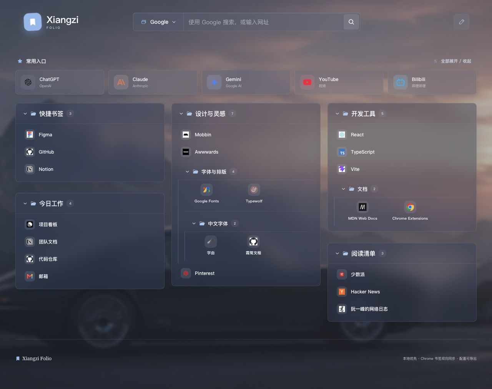
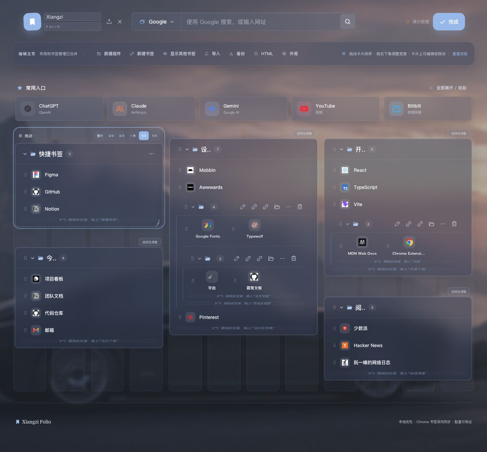
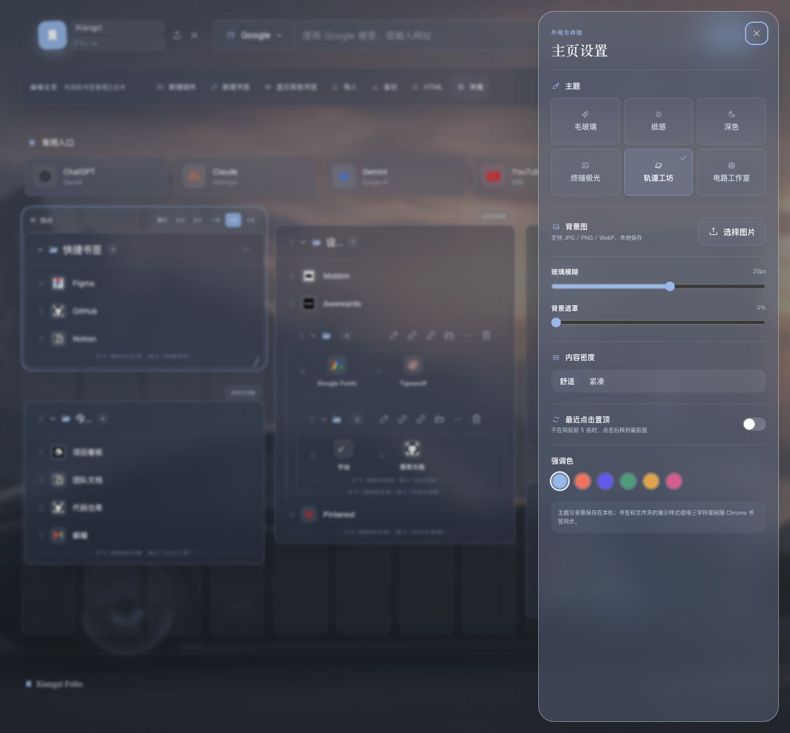

# Xiangzi Folio visual audit

## Scope

Desktop default homepage, unified edit mode, and appearance settings. Goal: make the extension feel immediately desirable while preserving its calm photographic glass identity.

## Step 1 — Default homepage (Good foundation, hierarchy needs work)

Strengths: distinctive cinematic atmosphere, recognizable sample bookmarks, clear search entry, and an unusually coherent glass treatment for a bookmark product.

Risks: most surfaces share nearly the same opacity and weight, so quick access, folders, nested folders, and individual bookmarks visually flatten into one layer. Bookmark text and secondary labels are small and low contrast. Mixed favicon quality makes the grid feel less curated than the surrounding UI.

Highest-impact changes:

1. Establish three explicit depth levels: quick access, top-level folder cards, and nested content.
2. Raise bookmark titles to roughly 13px and increase muted-text contrast; avoid 9–10px essential labels.
3. Normalize favicon presentation with consistent optical sizing, backing tiles, and fallback colors.
4. Turn quick access into the visual signature: stronger icon color, a clearer hover state, and slightly more separation from the folder grid.
5. Add a theme-aware readability scrim so bright wallpaper areas do not wash out cards and text.

## Step 2 — Edit mode (Functional, visually overloaded)

Strengths: editing is visibly separated from browsing, the selected component is identifiable, and controls are available without context menus.

Risks: column guides, dashed outlines, drag handles, width presets, nested actions, drop instructions, and the global toolbar appear at once. This makes the page look more like a layout debugger than a polished editor. Several controls and labels are very small.

Highest-impact changes:

1. Show grid guides only while dragging or resizing.
2. Show full controls only on the selected folder; keep other folders calm until hover or focus.
3. Replace repeated inline drop instructions with one contextual instruction near the active drag.
4. Group rare actions such as import, backup, and HTML under one compact data menu.
5. Increase edit control targets toward 36–40px and preserve visible keyboard focus.

## Step 3 — Appearance settings (Clear, but not emotionally persuasive)

Strengths: the panel is understandable, live context remains visible behind it, and the theme/background/density controls are logically grouped.

Risks: theme choices are text tiles rather than visual previews, so users cannot quickly feel the difference between themes. The panel has a large empty lower half, while important controls are tightly packed above. Slider values are visually weak.

Highest-impact changes:

1. Replace theme tiles with small real preview thumbnails showing wallpaper, surface, and typography together.
2. Use the empty lower area for a live sample card or selected-theme description.
3. Make slider values editable/readable chips and add reset-to-theme-default actions.
4. Clarify whether uploaded wallpaper overrides the theme background before the user chooses an image.

## Priority order

1. Typography and contrast.
2. Three-level visual hierarchy.
3. Normalized favicon treatment.
4. Signature quick-access row.
5. Progressive-disclosure edit mode.
6. Visual theme previews and micro-interactions.

## Accessibility evidence limits

Screenshots reveal likely contrast, text-size, and target-size risks, but they cannot confirm keyboard order, focus trapping, screen-reader output, reduced-motion handling, or contrast ratios over every wallpaper position. Those require interaction and automated/manual accessibility checks.
